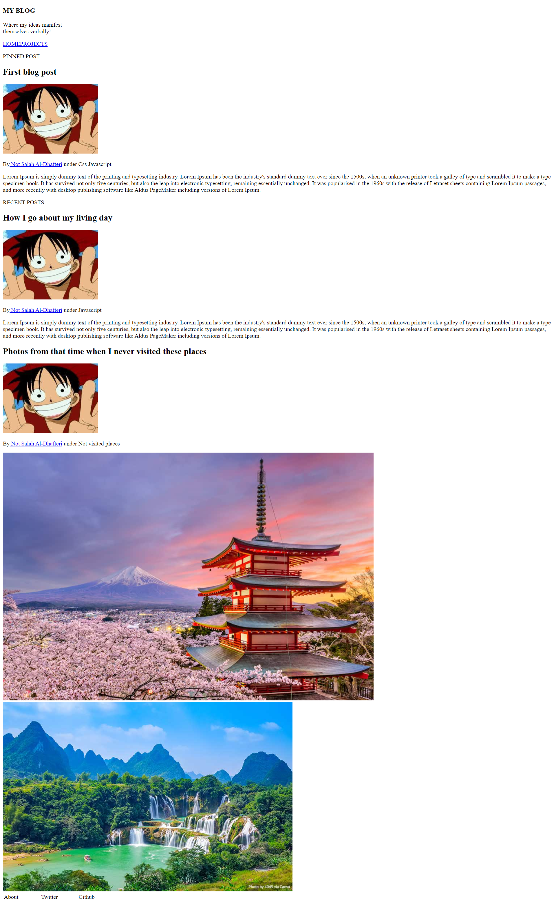

# HTML Only Blog

Your assignment in this activity is to create the following html page.

You can use the images that you like and put them, but make sure you use semantic tags and accessability attributes.

Create a directory inside `html-blog` folder, and put the names of your team as the folder name, i.e. `Osama-Wisam-Abdulrahman` then put your files inside the folder.

You can use VS Code [LiveShare extension pack](https://marketplace.visualstudio.com/items?itemName=MS-vsliveshare.vsliveshare-pack) to collaborate. Make sure you also install [Live Server extension](https://marketplace.visualstudio.com/items?itemName=ritwickdey.LiveServer) so everyone can see the results while collaborating. 

