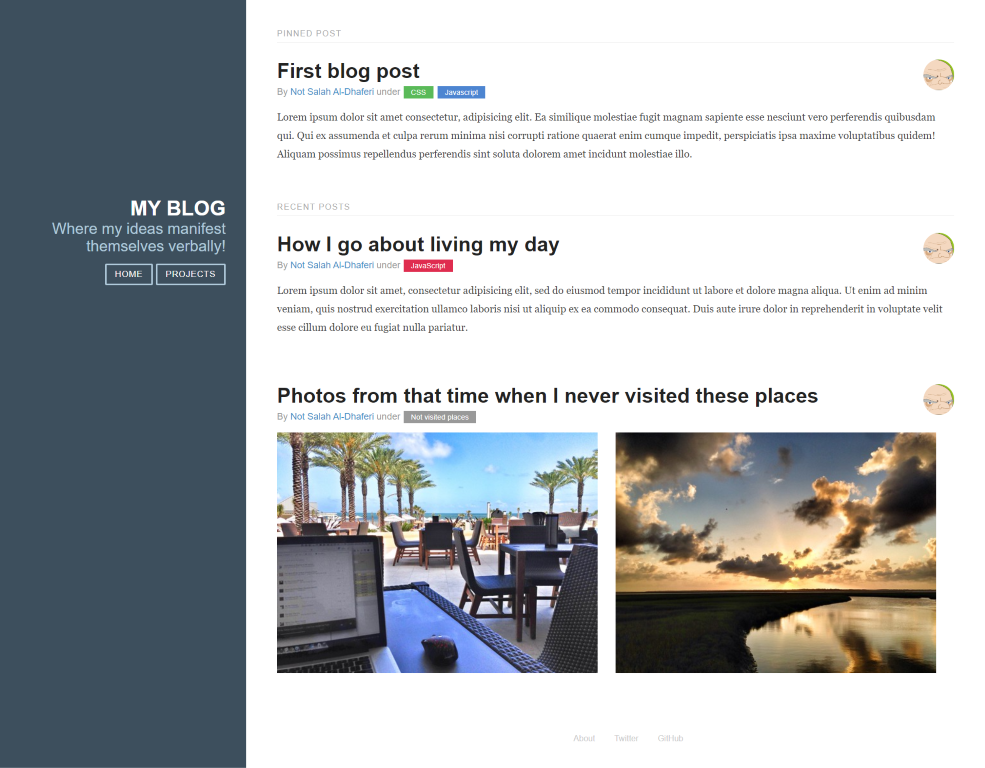

# Full Blog

Your assignment in this activity is to **style** the html only blog page *you've created last class*.

You can change the images you selected or use the same images.

Create a directory inside `full-blog` folder, and put the names of your team as the folder name, i.e. `Osama-Wisam-Abdulrahman` then put your files inside the folder.

In case you didn't manage to complete the HTML in last class, inside `assests` folder, there is a `raw.html` file that you can copy and use as your baseline html. 

**PS: Please focus on styling rather than html or functionality.**

You can use VS Code [LiveShare extension pack](https://marketplace.visualstudio.com/items?itemName=MS-vsliveshare.vsliveshare-pack) to collaborate. Make sure you also install [Live Server extension](https://marketplace.visualstudio.com/items?itemName=ritwickdey.LiveServer) so everyone can see the results while collaborating. 

